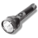
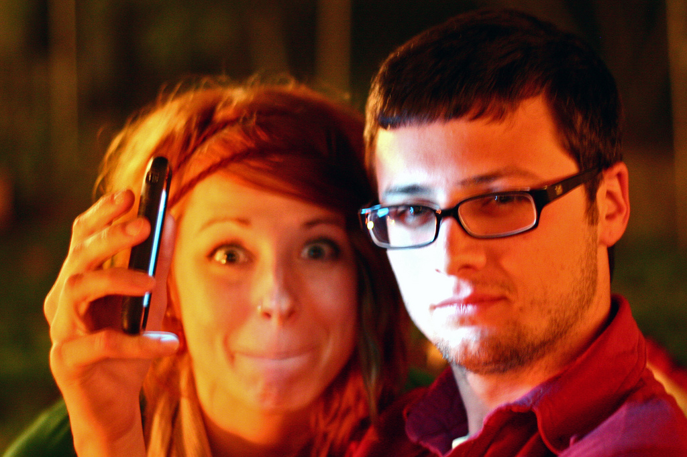
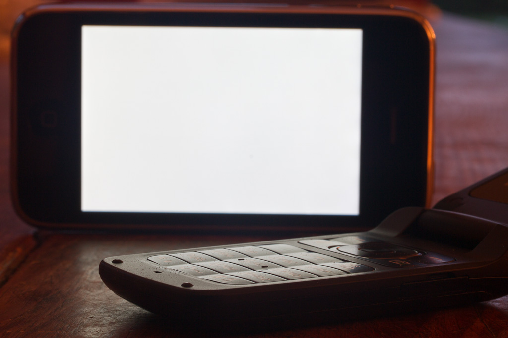
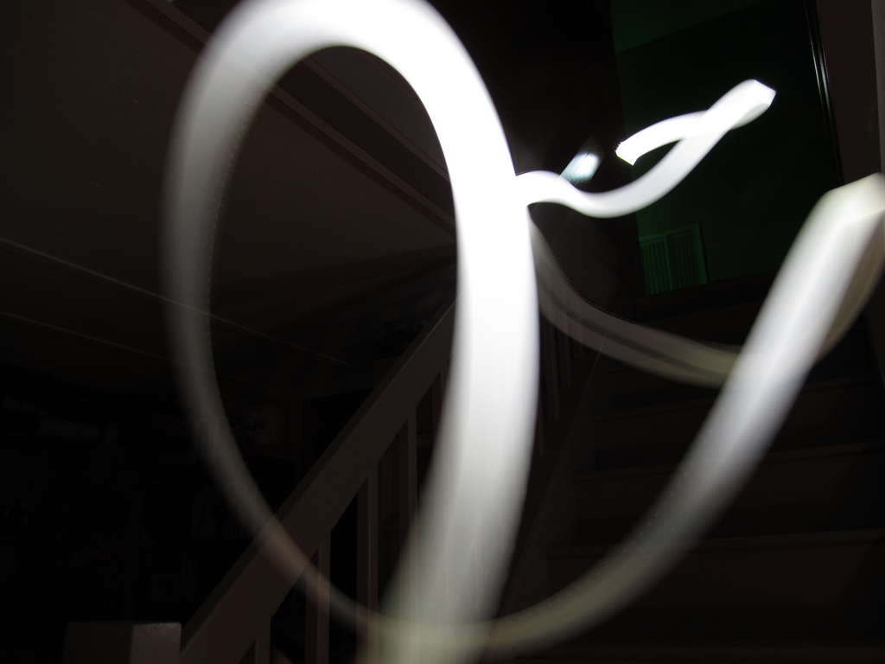

# Flashlight  

*The most simplistic flashlight app for Android.*

You can follow me on my <a href="https://goo.gl/U0x1Fy">development blog</a> for the latest news on this and other projects of mine.

## Download

App now available on Google Play Store.

## Screenshots

## Bugs, Problems, Feedback?

The more you tell me, the better my apps get. Please use the comments on <a href="http://goo.gl/l1lngU">Google Play Store</a> or visit <a href="http://goo.gl/KvKHze">my website</a> to post feedback. 

## Permissions

Your privacy is really important to me. Hence, this app does not require any permission at all.

## License

Copyright © 2017 Christian DeTamble

Licensed under the GNU General Public License, Version 3.0.

Screenshots:
* "IMG_8085e" from dangerismycat, CC BY-NC-ND 2.0, https://www.flickr.com/photos/neko43/3455904981/
* "8 second shutter" from Joshua Hilgart-Roy, CC BY-NC 2.0, https://www.flickr.com/photos/joshhr/5104186482/
* "Flashlight" from Roger H. Goun, CC BY 2.0, https://www.flickr.com/photos/sskennel/4841878469/

***

Crafted with &hearts; in <a href="http://goo.gl/KvKHze">The Refactory</a> in Ebensee 2017.

(My software is and stays open source, free of charge and ad-free)
